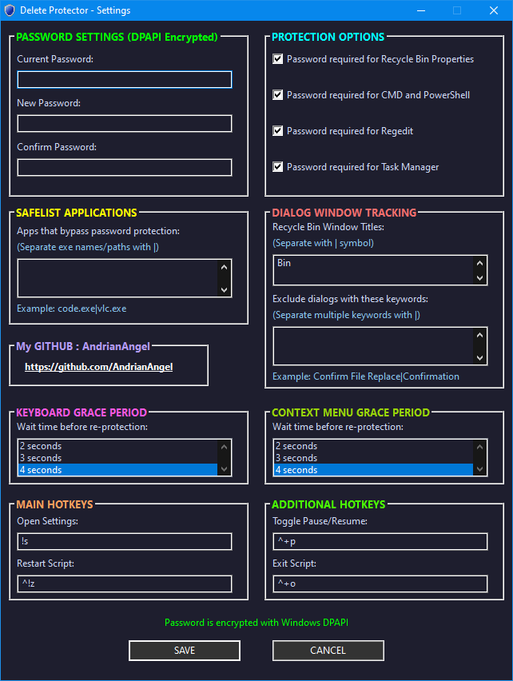
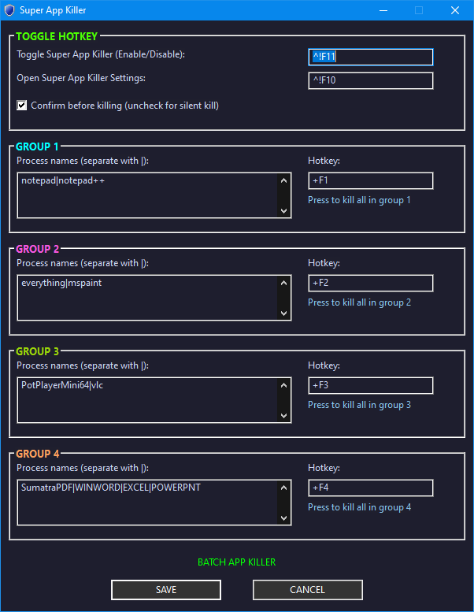
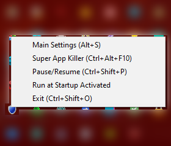
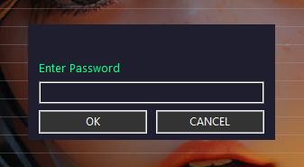
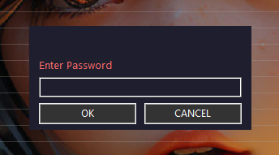
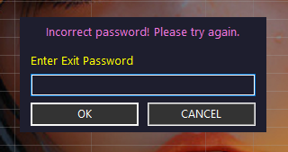
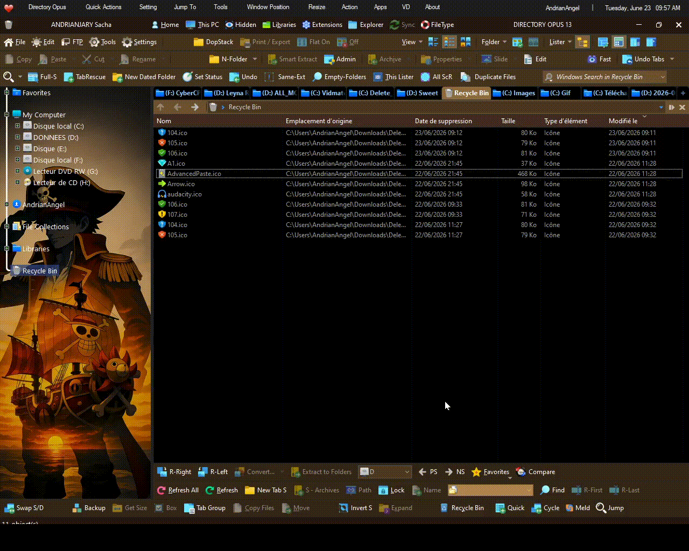
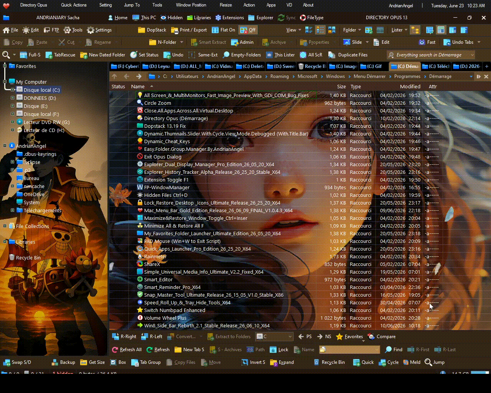
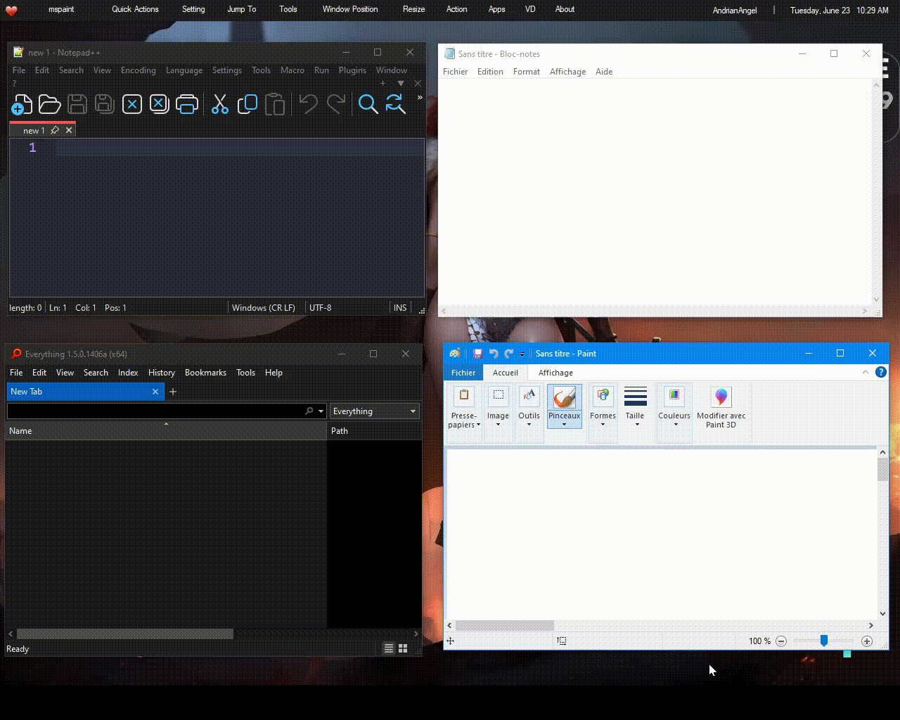

# 🛡️ DELETE PROTECTOR GOLD EDITION + 🛑 SUPER APP KILLER

> A powerful Windows system protection utility — safeguarding your files and system tools behind password authentication, with a built-in hotkey-driven app termination engine.

---

## ⚔️ OVERVIEW

**Delete Protector Gold Edition** is a lightweight, always-on Windows security script that intercepts file deletion attempts — whether triggered by keyboard shortcuts, right-click context menus, or the Recycle Bin — and enforces password verification before any destructive action is allowed. It also guards critical system utilities such as CMD, PowerShell, Registry Editor, and Task Manager.

Bundled with a **Super App Killer** module, this tool lets you define up to 4 custom app groups and terminate them instantly via hotkeys — ideal for rapid workspace cleanup, presentations, or focus sessions.

---

## ✨ KEY FEATURES

### 🔐 Delete Protection
- Intercepts `Delete`, `Shift+Delete`, and right-click **Context Menu Delete**
- Enforces a **4-second re-protection grace period** after each authorized deletion
- Password-protected access to **Settings**, **Pause/Resume**, and **Exit**
- Color-coded password prompt indicators: 🟢 Green (idle) · 🔴 Red (blocked) · 🟡 Yellow (warning) · 🩷 Pink (incorrect password)

### 🗑️ Recycle Bin Security
- Blocks **Empty Recycle Bin** actions
- Blocks access to **Recycle Bin Properties**

### 🖥️ System Tool Blocking
- Blocks **CMD** and **PowerShell** (regular and elevated/admin)
- Blocks **Registry Editor** (`regedit.exe`)
- Blocks **Task Manager** (`Taskmgr.exe`)

### 🔑 Password System
- Default password: `admin123` (configurable)
- Passwords are encrypted and stored securely via Windows DPAPI
- All sensitive actions (settings, pause, exit, app killer toggle) require authentication

### 🛑 Super App Killer
- Define up to **4 app groups**, each with custom `|`-separated process names
- Assign a dedicated hotkey to each group (e.g., `Shift+F1` through `Shift+F4`)
- Optional **confirmation prompt** before termination
- Toggle the entire module on/off with a master hotkey (`Ctrl+Alt+F11`)
- Built-in **system process blocklist** prevents accidental termination of critical Windows processes

### 📌 System Tray Integration
- Tray icon changes state between **Active** and **Super App Killer** modes
- Quick access to: Settings · Super App Killer · Pause/Resume · Startup Toggle · Exit
- **Run at Startup** support via Windows Startup folder shortcut

### ⚙️ Customizable Hotkeys
| Action | Default Hotkey |
|---|---|
| Open Settings | `Alt+S` |
| Restart Script | `Ctrl+Alt+Z` |
| Pause / Resume | `Ctrl+Shift+P` |
| Exit | `Ctrl+Shift+O` |
| Toggle Super App Killer | `Ctrl+Alt+F11` |
| Open App Killer Settings | `Ctrl+Alt+F10` |
| Kill Group 1–4 | `Shift+F1` – `Shift+F4` |

---

## ⚙️ Delete Protector — Main Settings

---

## 🛠️ Super App Killer — Settings

---

## 📌 Tray Menu

---

## 🔐 Password Prompt (Green — Idle)

---

## 🔐 Password Prompt (Red — Blocked)

---

## 🔐 Password Prompt (Yellow — Warning) + Incorrect Password (Pink)

---

## 📽️ DEMO

### ✔️ Delete · Shift+Delete · Context Menu Delete (+ Re-protection Grace Period: 4 sec)

---

### ✔️ Recycle Bin — Empty Trash & Properties Protection

---

### ✔️ CMD / PowerShell (Regular + Admin) · Registry Editor · Task Manager Blocking

---

### ✔️ Settings · Super App Killer · Pause · Exit — All Password Protected

---

### ✔️ Run at Startup (Tray Toggle)

---

### ✔️ Super App Killer (with Prompt) — Group 1: `notepad|notepad++` · Group 2: `everything|mspaint`

---

## 🚀 GETTING STARTED

1. Download the latest release: `Delete_Protector_V26_06_23_Gold_Edition_1.0.5.5_X64.exe` or `.zip`
2. Run as **Administrator** (required for system-level protection)
3. The script launches silently to the system tray
4. Default password is `admin123` — change it immediately via **Main Settings**

---

## 📋 REQUIREMENTS

- Windows 10 / 11 (x64)
- Administrator privileges

---
> 📁 **Note:** All demos are recorded using [Directory Opus 13](https://www.gpsoft.com.au/) as the file manager.
> The protection works with **any** file explorer or shell — Directory Opus is simply the author's preferred environment.
> As long as your file manager is not listed in the exclusion list, delete operations will be intercepted and protected regardless of which app initiates them.

> ⚡ **Performance Note:** The detection loop is configured at **50 ms** intervals for near-instant response.
> Any sluggishness visible in the demos is purely a result of OBS recording overhead combined with a low-end test machine — not a reflection of real-world performance.

---

## 📄 LICENSE

Copyright © AndrianAngel (GitHub) ❤️ — All rights reserved.
